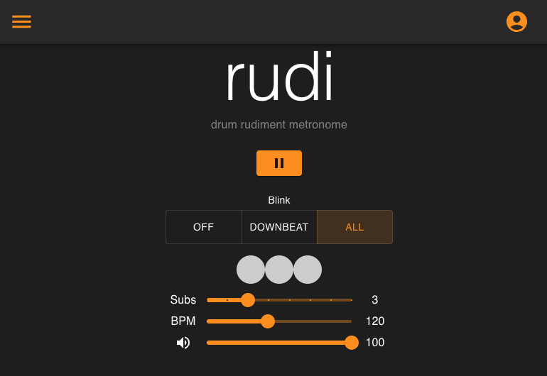

# Rudi Metronome (frontend)
View the [live deployment](https://tylersernett.github.io/rudi-drum).

This is the frontend repo. View backend code [here](https://github.com/tylersernett/rudi-backend).

## Description
Metronomes are essential tools for timing and rhythm practice. However, it can become tedious queuing up and tweaking different patterns for multiple drills. Rudi fixes this hassle by allowing the user to save and load customized metronome patterns.




## How It's Made:

**Tech used:** TypeScript, React, Material UI, PostgreSQL, Express, Docker, Tone.js

Inspired by [A Tale of Two Clocks](https://web.dev/articles/audio-scheduling#toc-rocksolid), I quickly realized that setTimeout is a poor choice when timing accuracy is required. Instead, the Web Audio API offers precision to the 0.1 microsecond level. Rather than use the raw API itself, I went with the [Tone.js library](https://tonejs.github.io/), as it already has some useful functionality built out: transports, samplers, and a draw function.

Within the Rudi GUI, users can set the BPM (beats per minute), Subs (note subdivisions), Volume, and control the blink behavior (off / every downbeat / every subdivision).

Rudi users the Tone.js sampler to load in some audio files at MIDI positions C3 (unaccented) and C4 (accented). When play is a clicked, a Tone.js sequence is created consisting of an array equal in legnth to the number of user-selected subdivisions. Using a sequence array ensures that the notes are spaced equally throughout a single beat:

```js
const subDivNotes = Array.from({ length: subdivisions - 1 }, () => "C3"); //the notes NOT on the downbeat
sequence.current = new Tone.Sequence((time, note) => {
  if (sampler.current) {
    sampler.current.triggerAttackRelease(note, "32n", time);
  }
}, [["C4", ...subDivNotes]], "4n").start(restartTime);
```

However, it is not possible to assign draw events using a sequence. Instead, a Tone.js Loop is created consisting of a new call for each subdivision. The proper timing is achieved using a Tone.js Time Object, where the unit is defined as `xn`, where `x` is the number of subdivisions within a 4/4 measure. For example, `16n` is a 16th note, as there are 16 in a standard 4/4 measure. Likewise, `24n` represents 16th note triplets, as there are 24 in a standard 4/4 measure. The placement of these draw events is defined by the line: 
```js
const timeObj = { [timeStr]: i } as TimeObject
```
where i is the particular subdivision being queued. When i=0, there is no delay. When i=2, it will be delayed by `2 * xn` units.

The full Loop code is referenced below:

```js
new Tone.Loop((time) => {
  for (let i = 0; i < subdivisions; i++) {
    const prefix = 4 * subdivisions;
    const timeStr = `${prefix}n`;
    //Object, ({"4n" : 3, "8t" : -1}). The resulting time is equal to the sum of all of the keys multiplied by the values in the object.
    const timeObj = { [timeStr]: i } as TimeObject
    const timeString = i === 0 ? time : time + Tone.Transport.toSeconds(timeObj)
    Tone.Draw.schedule(() => {
      setIsBlinking(prevIsBlinking => {
        console.log(prevIsBlinking)
        const updatedIsBlinking = [...prevIsBlinking];
        if (updatedIsBlinking[i] !== undefined) {
          updatedIsBlinking[i] = true; // Only update if index already exists - prevent state error
        }
        console.log(updatedIsBlinking)
        return updatedIsBlinking;
      })
    }, timeString) //use AudioContext time of the event
  }
}, "4n").start(restartTime)
```

When a user clicks the 'Browse' button from the main menu, previously saved metronomes are displayed in a sortable table: 


## Future Optimizations

1. Add multiple tones for users to choose from
2. Add a "grader" that detects how many miliseconds an input is ahead/behind the beat
3. Add unit, integretion, e2e tests
4. Add the ability to chain multiple metronome beats together into a 'pattern'
5. Add a user profile page
6. Add a tap tempo feature